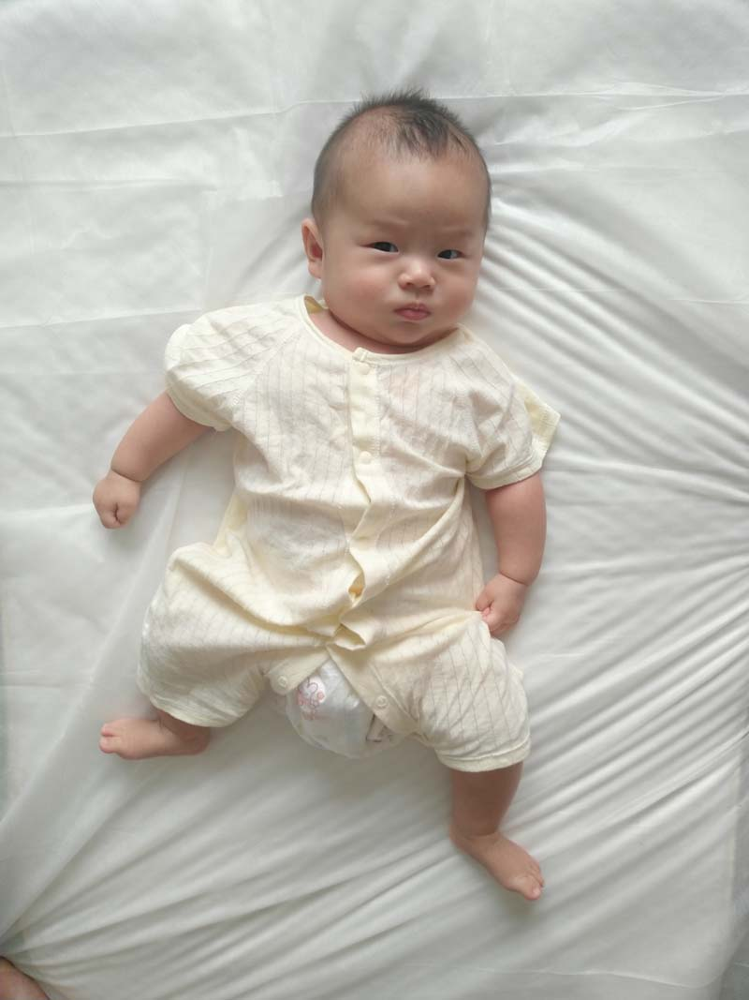
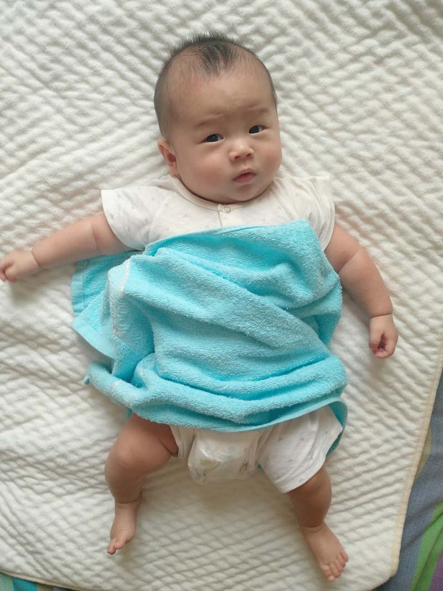
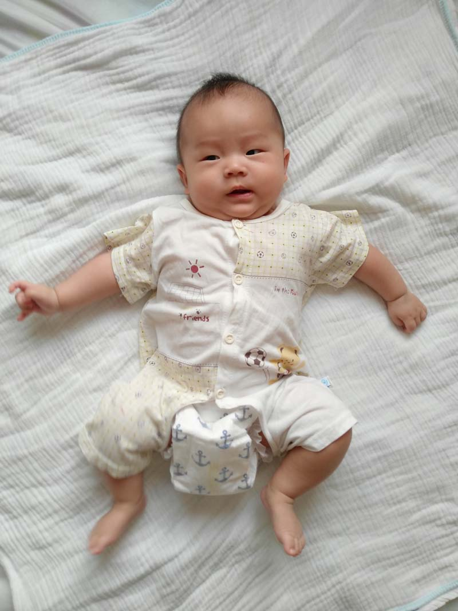
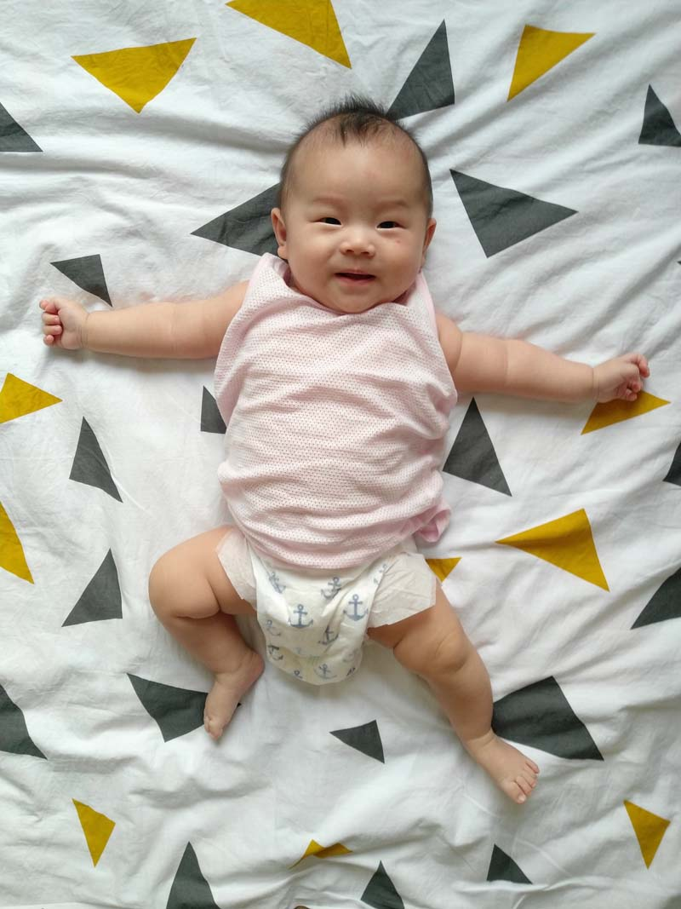
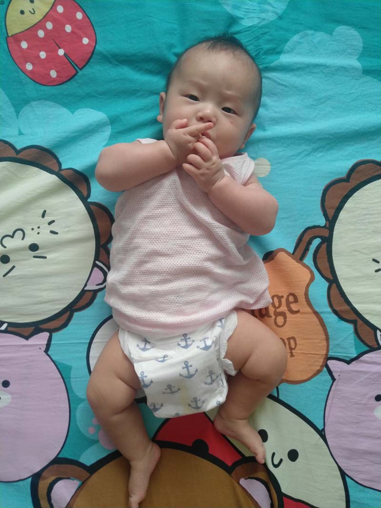
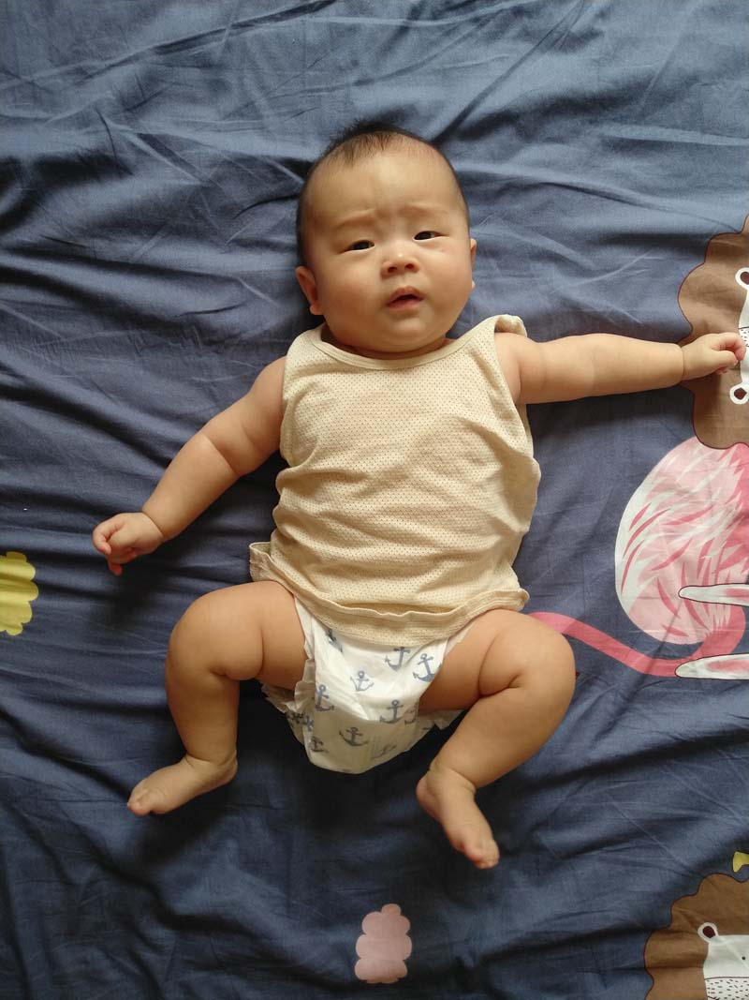
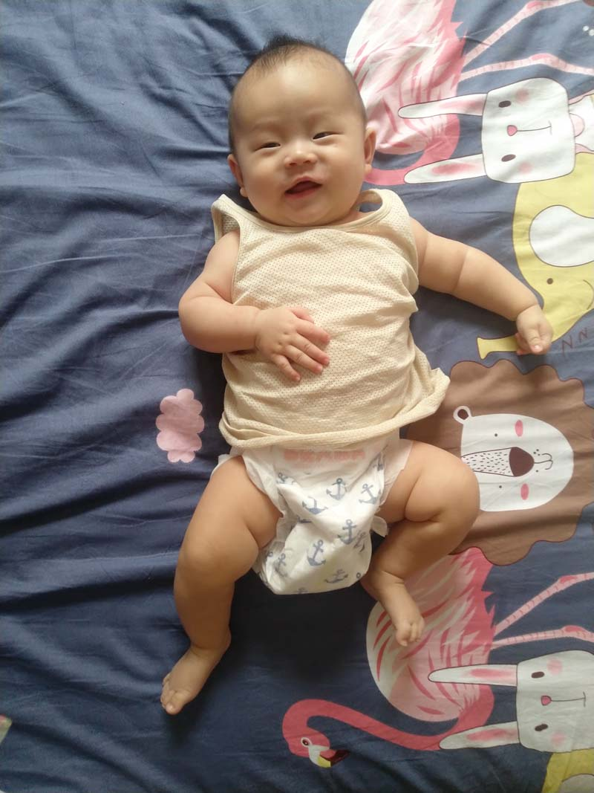
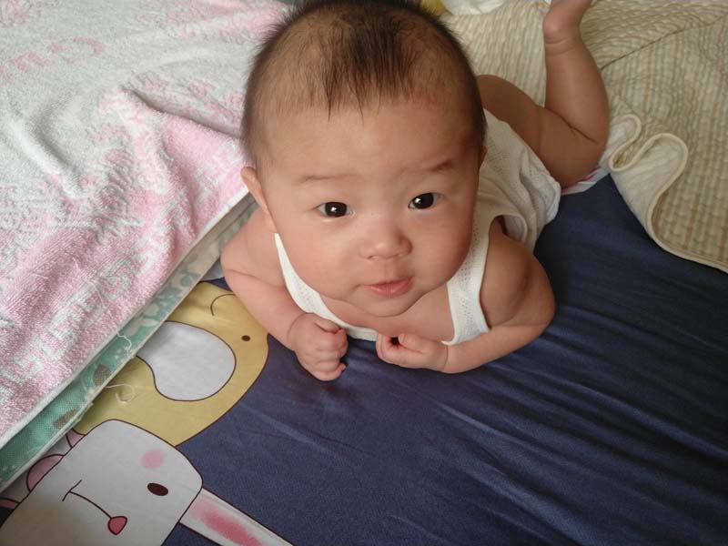

# 2020年6月

<figure>
  <figcaption>&#x2191; 2020-06-01 </figcaption>
</figure>

<figure>
  <figcaption>&#x2191; 2020-06-02 </figcaption>
</figure>

<figure>
  <figcaption>&#x2191; 2020-06-03 </figcaption>
</figure>

<figure>
  <figcaption>&#x2191; 2020-06-04 </figcaption>
</figure>

<figure>
  <figcaption>&#x2191; 2020-06-05 </figcaption>
</figure>

<figure>
  <figcaption>&#x2191; 2020-06-06 </figcaption>
</figure>

<figure>
  <figcaption>&#x2191; 2020-06-07 </figcaption>
</figure>

<figure>
  <figcaption>&#x2191; 2020-06-08</figcaption>
</figure>

<figure>
  <figcaption>&#x2191; 2020-06-09 </figcaption>
</figure>

<figure>
  <figcaption>&#x2191; 2020-06-10 </figcaption>
</figure>

<figure>
  <figcaption>&#x2191; 2020-06-11 </figcaption>
</figure>

<figure>
  <figcaption>&#x2191; 2020-06-12 </figcaption>
</figure>

<figure>
  <figcaption>&#x2191; 2020-06-13 </figcaption>
</figure>

<figure>
  <figcaption>&#x2191; 2020-06-14 </figcaption>
</figure>

<figure>
  <figcaption>&#x2191; 2020-06-15 </figcaption>
</figure>

<figure>
  <figcaption>&#x2191; 2020-06-16 </figcaption>
</figure>

<figure>
  <figcaption>&#x2191; 2020-06-17 </figcaption>
</figure>

<figure>
  <figcaption>&#x2191; 2020-06-18 </figcaption>
</figure>

<figure>
  <figcaption>&#x2191; 2020-06-19 </figcaption>
</figure>

<figure>
  <figcaption>&#x2191; 2020-06-20 </figcaption>
</figure>

<figure>
  <figcaption>&#x2191; 2020-06-21 </figcaption>
</figure>

<figure>
  <figcaption>&#x2191; 2020-06-22 </figcaption>
</figure>

<figure>
  <figcaption>&#x2191; 2020-06-23 </figcaption>
</figure>

<figure>
  <figcaption>&#x2191; 2020-06-24 </figcaption>
</figure>

<figure>
  <figcaption>&#x2191; 2020-06-25 </figcaption>
</figure>

<figure>
  <figcaption>&#x2191; 2020-06-26 </figcaption>
</figure>

<figure>
  <figcaption>&#x2191; 2020-06-27 </figcaption>
</figure>

<figure>
  <figcaption>&#x2191; 2020-06-28 </figcaption>
</figure>

<figure>
  <figcaption>&#x2191; 2020-06-29 </figcaption>
</figure>

<figure>
  <figcaption>&#x2191; 2020-06-30 </figcaption>
</figure>
