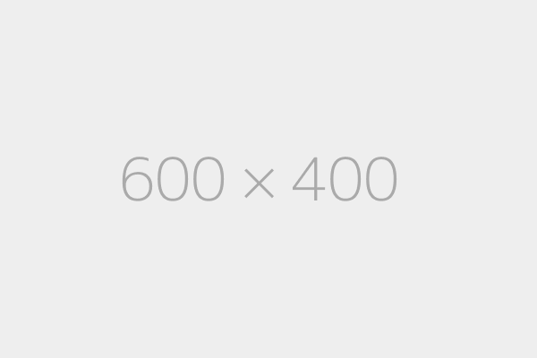

# 2020年7月

{: loading=lazy }
<figure>
  <figcaption>&#x2191; 2020-07-01 </figcaption>
</figure>
{: loading=lazy }
<figure>
  <figcaption>&#x2191; 2020-07-02 </figcaption>
</figure>
{: loading=lazy }
<figure>
  <figcaption>&#x2191; 2020-07-03 </figcaption>
</figure>
{: loading=lazy }
<figure>
  <figcaption>&#x2191; 2020-07-04 </figcaption>
</figure>
{: loading=lazy }
<figure>
  <figcaption>&#x2191; 2020-07-05 </figcaption>
</figure>
{: loading=lazy }
<figure>
  <figcaption>&#x2191; 2020-07-06 </figcaption>
</figure>
{: loading=lazy }
<figure>
  <figcaption>&#x2191; 2020-07-07 </figcaption>
</figure>
{: loading=lazy }
<figure>
  <figcaption>&#x2191; 2020-07-08</figcaption>
</figure>
{: loading=lazy }
<figure>
  <figcaption>&#x2191; 2020-07-09 </figcaption>
</figure>
{: loading=lazy }
<figure>
  <figcaption>&#x2191; 2020-07-10 </figcaption>
</figure>
{: loading=lazy }
<figure>
  <figcaption>&#x2191; 2020-07-11 </figcaption>
</figure>
{: loading=lazy }
<figure>
  <figcaption>&#x2191; 2020-07-12 </figcaption>
</figure>
{: loading=lazy }
<figure>
  <figcaption>&#x2191; 2020-07-13 </figcaption>
</figure>
{: loading=lazy }
<figure>
  <figcaption>&#x2191; 2020-07-14 </figcaption>
</figure>
{: loading=lazy }
<figure>
  <figcaption>&#x2191; 2020-07-15 </figcaption>
</figure>
{: loading=lazy }
<figure>
  <figcaption>&#x2191; 2020-07-16 </figcaption>
</figure>
{: loading=lazy }
<figure>
  <figcaption>&#x2191; 2020-07-17 </figcaption>
</figure>
{: loading=lazy }
<figure>
  <figcaption>&#x2191; 2020-07-18 </figcaption>
</figure>
{: loading=lazy }
<figure>
  <figcaption>&#x2191; 2020-07-19 </figcaption>
</figure>
{: loading=lazy }
<figure>
  <figcaption>&#x2191; 2020-07-20 </figcaption>
</figure>
{: loading=lazy }
<figure>
  <figcaption>&#x2191; 2020-07-21 </figcaption>
</figure>
{: loading=lazy }
<figure>
  <figcaption>&#x2191; 2020-07-22 </figcaption>
</figure>
{: loading=lazy }
<figure>
  <figcaption>&#x2191; 2020-07-23 </figcaption>
</figure>
{: loading=lazy }
<figure>
  <figcaption>&#x2191; 2020-07-24 </figcaption>
</figure>
{: loading=lazy }
<figure>
  <figcaption>&#x2191; 2020-07-25 </figcaption>
</figure>
{: loading=lazy }
<figure>
  <figcaption>&#x2191; 2020-07-26 </figcaption>
</figure>
{: loading=lazy }
<figure>
  <figcaption>&#x2191; 2020-07-27 </figcaption>
</figure>
{: loading=lazy }
<figure>
  <figcaption>&#x2191; 2020-07-28 </figcaption>
</figure>
{: loading=lazy }
<figure>
  <figcaption>&#x2191; 2020-07-29 </figcaption>
</figure>
{: loading=lazy }
<figure>
  <figcaption>&#x2191; 2020-07-30 </figcaption>
</figure>
{: loading=lazy }
<figure>
  <figcaption>&#x2191; 2020-07-31 </figcaption>
</figure>
