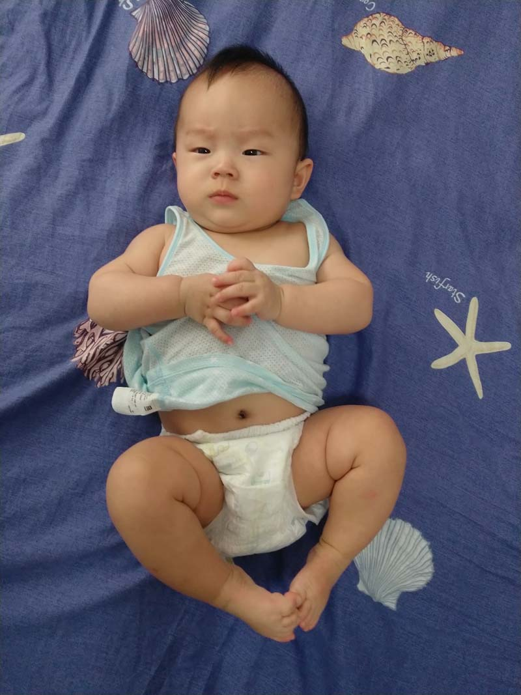
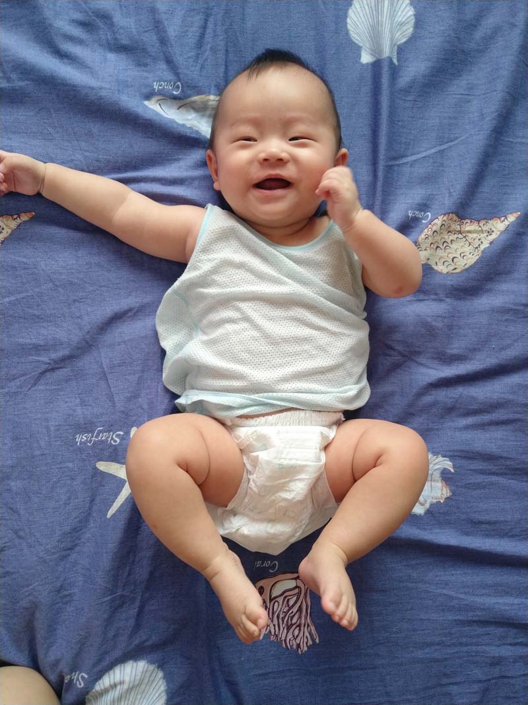
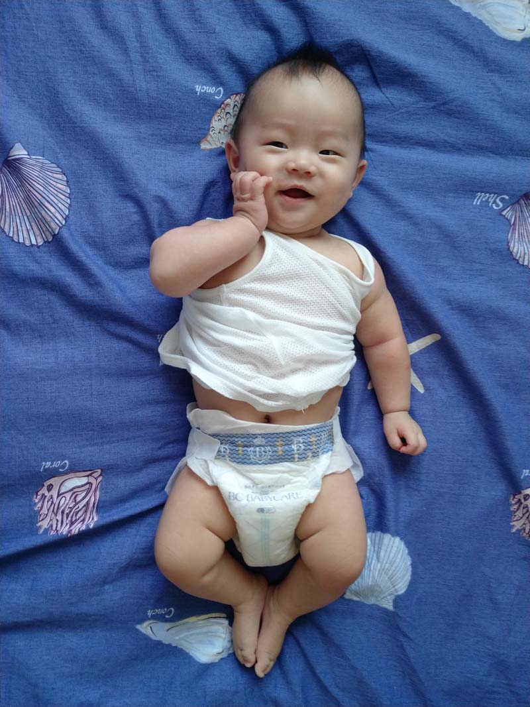
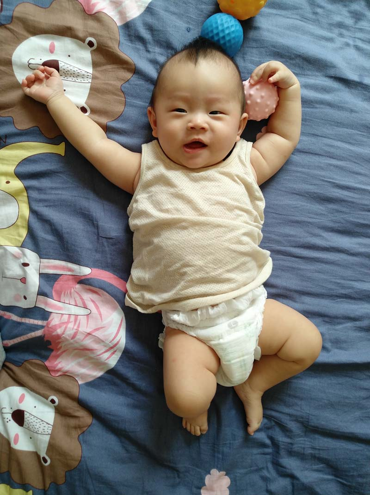
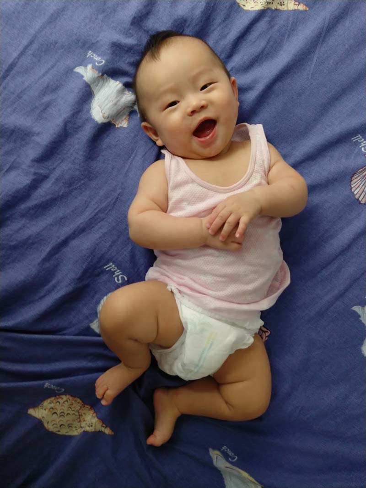
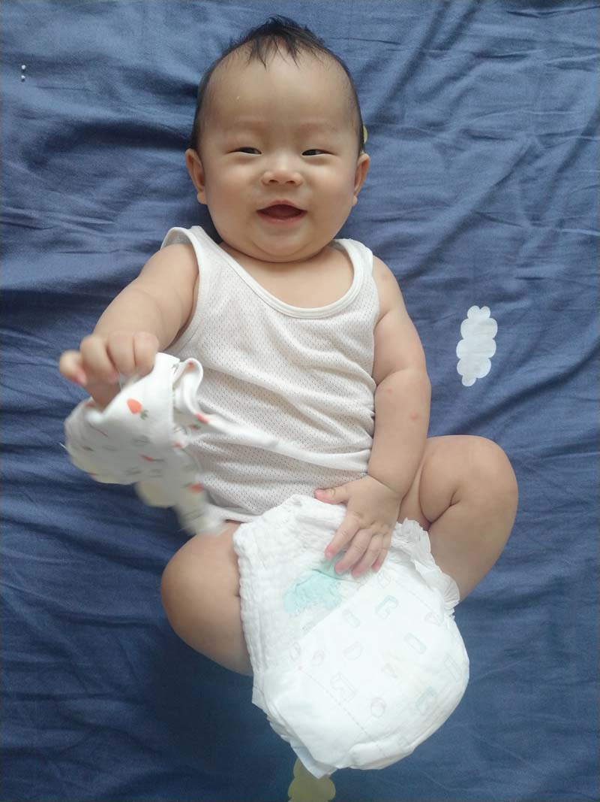
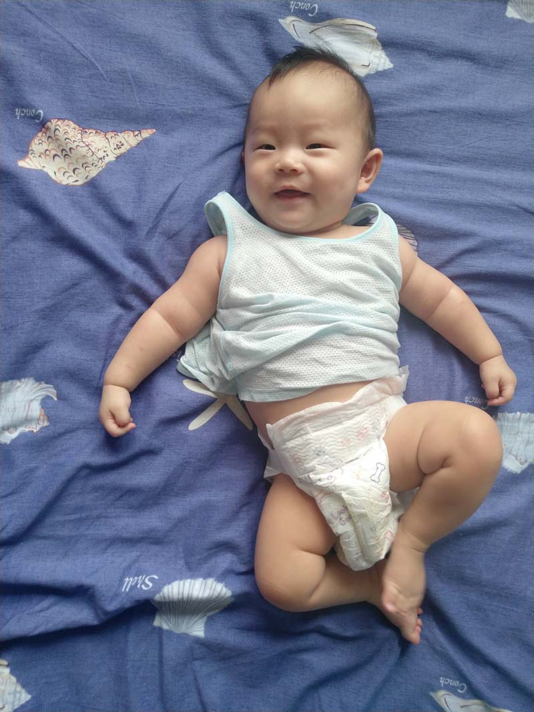
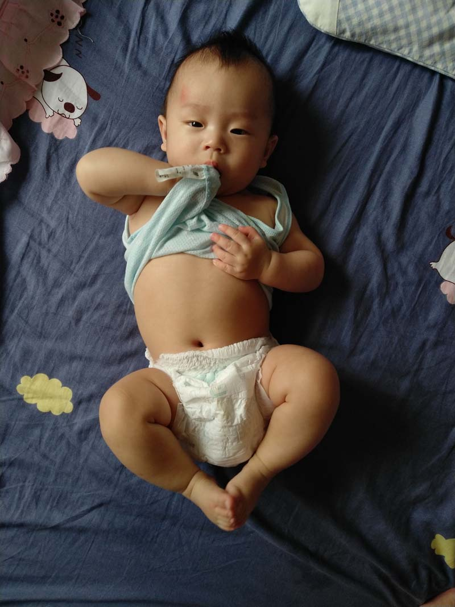
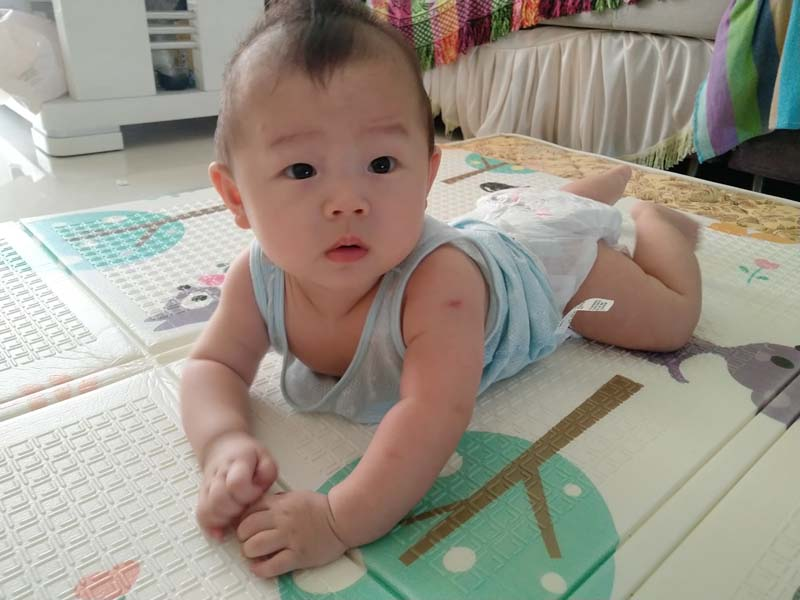

# 2020年8月

<figure>
  <figcaption>&#x2191; 2020-08-01 </figcaption>
</figure>

<figure>
  <figcaption>&#x2191; 2020-08-02 </figcaption>
</figure>

<figure>
  <figcaption>&#x2191; 2020-08-03 </figcaption>
</figure>

<figure>
  <figcaption>&#x2191; 2020-08-04 </figcaption>
</figure>

<figure>
  <figcaption>&#x2191; 2020-08-05 </figcaption>
</figure>

<figure>
  <figcaption>&#x2191; 2020-08-06 </figcaption>
</figure>

<figure>
  <figcaption>&#x2191; 2020-08-07 </figcaption>
</figure>

<figure>
  <figcaption>&#x2191; 2020-08-08</figcaption>
</figure>

<figure>
  <figcaption>&#x2191; 2020-08-09 </figcaption>
</figure>

<figure>
  <figcaption>&#x2191; 2020-08-10 </figcaption>
</figure>

<figure>
  <figcaption>&#x2191; 2020-08-11 </figcaption>
</figure>

<figure>
  <figcaption>&#x2191; 2020-08-12 </figcaption>
</figure>

<figure>
  <figcaption>&#x2191; 2020-08-13 </figcaption>
</figure>

<figure>
  <figcaption>&#x2191; 2020-08-14 </figcaption>
</figure>

<figure>
  <figcaption>&#x2191; 2020-08-15 </figcaption>
</figure>

<figure>
  <figcaption>&#x2191; 2020-08-16 </figcaption>
</figure>

<figure>
  <figcaption>&#x2191; 2020-08-17 </figcaption>
</figure>

<figure>
  <figcaption>&#x2191; 2020-08-18 </figcaption>
</figure>

<figure>
  <figcaption>&#x2191; 2020-08-19 </figcaption>
</figure>

<figure>
  <figcaption>&#x2191; 2020-08-20 </figcaption>
</figure>

<figure>
  <figcaption>&#x2191; 2020-08-21 </figcaption>
</figure>

<figure>
  <figcaption>&#x2191; 2020-08-22 </figcaption>
</figure>

<figure>
  <figcaption>&#x2191; 2020-08-23 </figcaption>
</figure>

<figure>
  <figcaption>&#x2191; 2020-08-24 </figcaption>
</figure>

<figure>
  <figcaption>&#x2191; 2020-08-25 </figcaption>
</figure>

<figure>
  <figcaption>&#x2191; 2020-08-26 </figcaption>
</figure>

<figure>
  <figcaption>&#x2191; 2020-08-27 </figcaption>
</figure>

<figure>
  <figcaption>&#x2191; 2020-08-28 </figcaption>
</figure>

<figure>
  <figcaption>&#x2191; 2020-08-29 </figcaption>
</figure>

<figure>
  <figcaption>&#x2191; 2020-08-30 </figcaption>
</figure>

<figure>
  <figcaption>&#x2191; 2020-08-31 </figcaption>
</figure>
