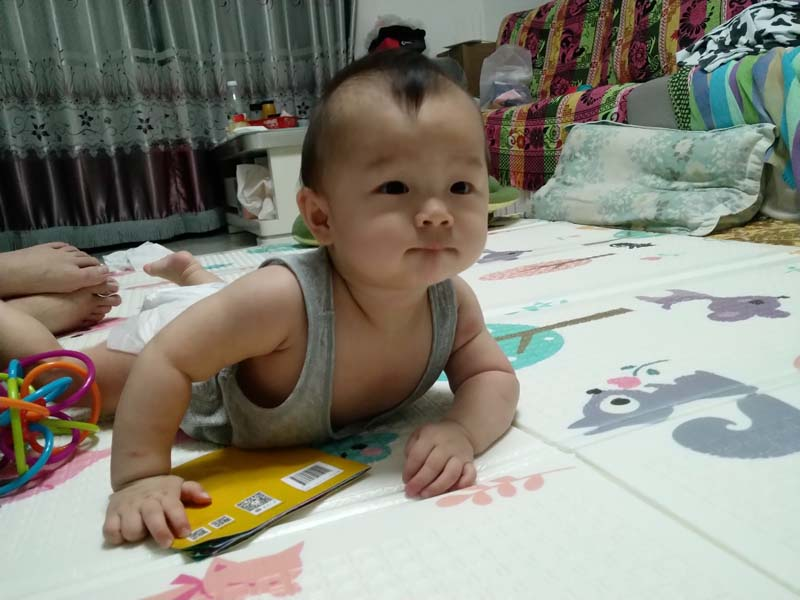

# 2020年9月

<figure>
  <figcaption>&#x2191; 2020-09-01 </figcaption>
</figure>

<figure>
  <figcaption>&#x2191; 2020-09-02 </figcaption>
</figure>

<figure>
  <figcaption>&#x2191; 2020-09-03 </figcaption>
</figure>

<figure>
  <figcaption>&#x2191; 2020-09-04 </figcaption>
</figure>

<figure>
  <figcaption>&#x2191; 2020-09-05 </figcaption>
</figure>

<figure>
  <figcaption>&#x2191; 2020-09-06 </figcaption>
</figure>

<figure>
  <figcaption>&#x2191; 2020-09-07 </figcaption>
</figure>

<figure>
  <figcaption>&#x2191; 2020-09-08</figcaption>
</figure>

<figure>
  <figcaption>&#x2191; 2020-09-09 </figcaption>
</figure>

<figure>
  <figcaption>&#x2191; 2020-09-10 </figcaption>
</figure>

<figure>
  <figcaption>&#x2191; 2020-09-11 </figcaption>
</figure>

<figure>
  <figcaption>&#x2191; 2020-09-12 </figcaption>
</figure>

<figure>
  <figcaption>&#x2191; 2020-09-13 </figcaption>
</figure>

<figure>
  <figcaption>&#x2191; 2020-09-14 </figcaption>
</figure>

<figure>
  <figcaption>&#x2191; 2020-09-15 </figcaption>
</figure>

<figure>
  <figcaption>&#x2191; 2020-09-16 </figcaption>
</figure>

<figure>
  <figcaption>&#x2191; 2020-09-17 </figcaption>
</figure>

<figure>
  <figcaption>&#x2191; 2020-09-18 </figcaption>
</figure>

<figure>
  <figcaption>&#x2191; 2020-09-19 </figcaption>
</figure>

<figure>
  <figcaption>&#x2191; 2020-09-20 </figcaption>
</figure>

<figure>
  <figcaption>&#x2191; 2020-09-21 </figcaption>
</figure>

<figure>
  <figcaption>&#x2191; 2020-09-22 </figcaption>
</figure>

<figure>
  <figcaption>&#x2191; 2020-09-23 </figcaption>
</figure>

<figure>
  <figcaption>&#x2191; 2020-09-24 </figcaption>
</figure>

<figure>
  <figcaption>&#x2191; 2020-09-25 </figcaption>
</figure>

<figure>
  <figcaption>&#x2191; 2020-09-26 </figcaption>
</figure>

<figure>
  <figcaption>&#x2191; 2020-09-27 </figcaption>
</figure>

<figure>
  <figcaption>&#x2191; 2020-09-28 </figcaption>
</figure>

<figure>
  <figcaption>&#x2191; 2020-09-29 </figcaption>
</figure>

<figure>
  <figcaption>&#x2191; 2020-09-30 </figcaption>
</figure>
