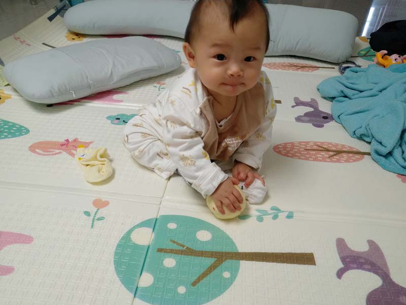
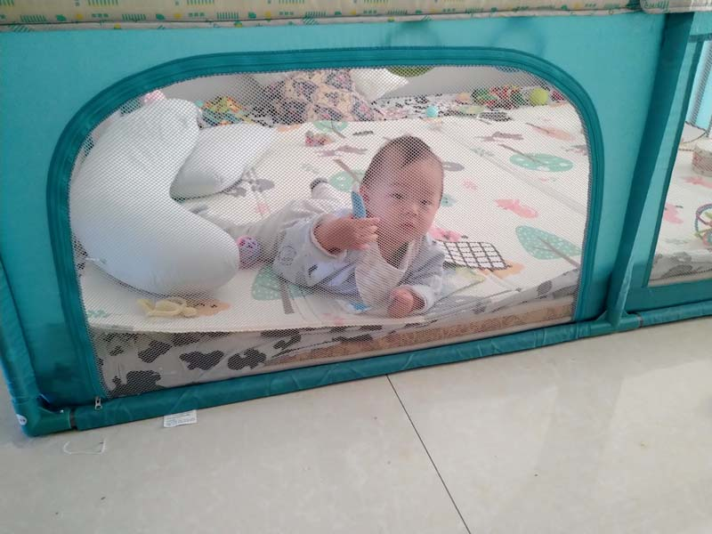
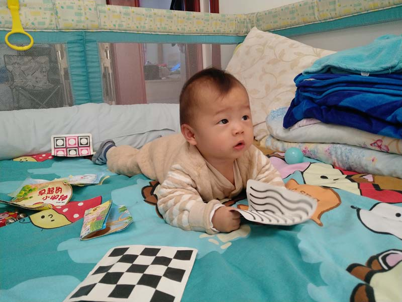

# 2020年10月

<figure>
  <figcaption>&#x2191; 2020-10-01 </figcaption>
</figure>

<figure>
  <figcaption>&#x2191; 2020-10-02 </figcaption>
</figure>

<figure>
  <figcaption>&#x2191; 2020-10-03 </figcaption>
</figure>

<figure>
  <figcaption>&#x2191; 2020-10-04 </figcaption>
</figure>

<figure>
  <figcaption>&#x2191; 2020-10-05 </figcaption>
</figure>

<figure>
  <figcaption>&#x2191; 2020-10-06 </figcaption>
</figure>

<figure>
  <figcaption>&#x2191; 2020-10-07 </figcaption>
</figure>

<figure>
  <figcaption>&#x2191; 2020-10-08</figcaption>
</figure>

<figure>
  <figcaption>&#x2191; 2020-10-09 </figcaption>
</figure>

<figure>
  <figcaption>&#x2191; 2020-10-10 </figcaption>
</figure>

<figure>
  <figcaption>&#x2191; 2020-10-11 </figcaption>
</figure>

<figure>
  <figcaption>&#x2191; 2020-10-12 </figcaption>
</figure>

<figure>
  <figcaption>&#x2191; 2020-10-13 </figcaption>
</figure>

<figure>
  <figcaption>&#x2191; 2020-10-14 </figcaption>
</figure>

<figure>
  <figcaption>&#x2191; 2020-10-15 </figcaption>
</figure>

<figure>
  <figcaption>&#x2191; 2020-10-16 </figcaption>
</figure>

<figure>
  <figcaption>&#x2191; 2020-10-17 </figcaption>
</figure>

<figure>
  <figcaption>&#x2191; 2020-10-18 </figcaption>
</figure>

<figure>
  <figcaption>&#x2191; 2020-10-19 </figcaption>
</figure>

<figure>
  <figcaption>&#x2191; 2020-10-20 </figcaption>
</figure>

<figure>
  <figcaption>&#x2191; 2020-10-21 </figcaption>
</figure>

<figure>
  <figcaption>&#x2191; 2020-10-22 </figcaption>
</figure>

<figure>
  <figcaption>&#x2191; 2020-10-23 </figcaption>
</figure>

<figure>
  <figcaption>&#x2191; 2020-10-24 </figcaption>
</figure>

<figure>
  <figcaption>&#x2191; 2020-10-25 </figcaption>
</figure>

<figure>
  <figcaption>&#x2191; 2020-10-26 </figcaption>
</figure>

<figure>
  <figcaption>&#x2191; 2020-10-27 </figcaption>
</figure>

<figure>
  <figcaption>&#x2191; 2020-10-28 </figcaption>
</figure>

<figure>
  <figcaption>&#x2191; 2020-10-29 </figcaption>
</figure>

<figure>
  <figcaption>&#x2191; 2020-10-30 </figcaption>
</figure>

<figure>
  <figcaption>&#x2191; 2020-10-31 </figcaption>
</figure>
