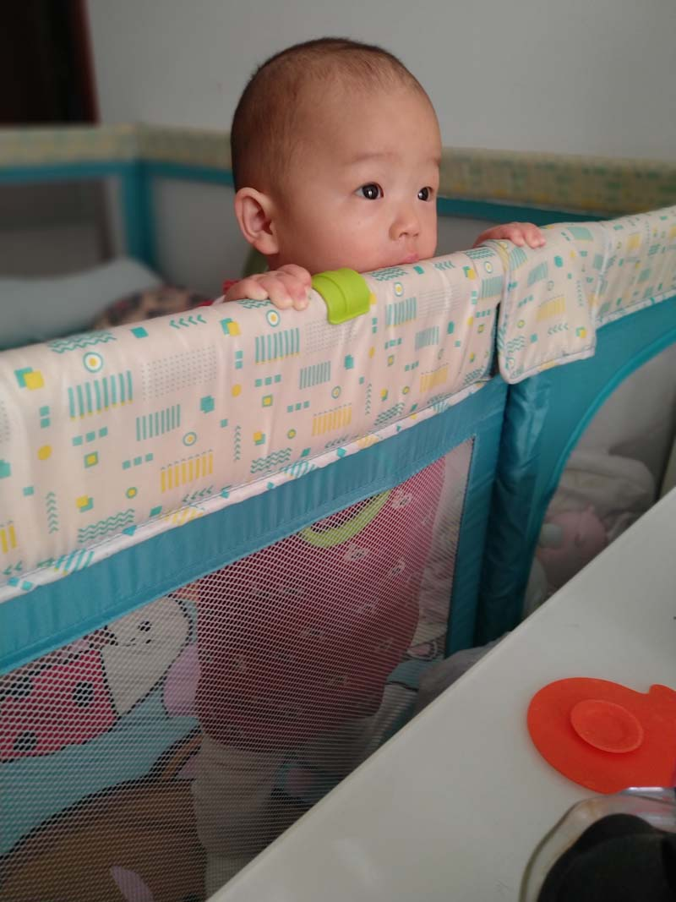

# 2020年11月

<figure>
  <figcaption>&#x2191; 2020-11-01 </figcaption>
</figure>

<figure>
  <figcaption>&#x2191; 2020-11-02 </figcaption>
</figure>

<figure>
  <figcaption>&#x2191; 2020-11-03 </figcaption>
</figure>

<figure>
  <figcaption>&#x2191; 2020-11-04 </figcaption>
</figure>

<figure>
  <figcaption>&#x2191; 2020-11-05 </figcaption>
</figure>

<figure>
  <figcaption>&#x2191; 2020-11-06 </figcaption>
</figure>

<figure>
  <figcaption>&#x2191; 2020-11-07 </figcaption>
</figure>

<figure>
  <figcaption>&#x2191; 2020-11-08</figcaption>
</figure>

<figure>
  <figcaption>&#x2191; 2020-11-09 </figcaption>
</figure>

<figure>
  <figcaption>&#x2191; 2020-11-10 </figcaption>
</figure>

<figure>
  <figcaption>&#x2191; 2020-11-11 </figcaption>
</figure>

<figure>
  <figcaption>&#x2191; 2020-11-12 </figcaption>
</figure>

<figure>
  <figcaption>&#x2191; 2020-11-13 </figcaption>
</figure>

<figure>
  <figcaption>&#x2191; 2020-11-14 </figcaption>
</figure>

<figure>
  <figcaption>&#x2191; 2020-11-15 </figcaption>
</figure>

<figure>
  <figcaption>&#x2191; 2020-11-16 </figcaption>
</figure>

<figure>
  <figcaption>&#x2191; 2020-11-17 </figcaption>
</figure>

<figure>
  <figcaption>&#x2191; 2020-11-18 </figcaption>
</figure>

<figure>
  <figcaption>&#x2191; 2020-11-19 </figcaption>
</figure>

<figure>
  <figcaption>&#x2191; 2020-11-20 </figcaption>
</figure>

<figure>
  <figcaption>&#x2191; 2020-11-21 </figcaption>
</figure>

<figure>
  <figcaption>&#x2191; 2020-11-22 </figcaption>
</figure>

<figure>
  <figcaption>&#x2191; 2020-11-23 </figcaption>
</figure>

<figure>
  <figcaption>&#x2191; 2020-11-24 </figcaption>
</figure>

<figure>
  <figcaption>&#x2191; 2020-11-25 </figcaption>
</figure>

<figure>
  <figcaption>&#x2191; 2020-11-26 </figcaption>
</figure>

<figure>
  <figcaption>&#x2191; 2020-11-27 </figcaption>
</figure>

<figure>
  <figcaption>&#x2191; 2020-11-28 </figcaption>
</figure>

<figure>
  <figcaption>&#x2191; 2020-11-29 </figcaption>
</figure>

<figure>
  <figcaption>&#x2191; 2020-11-30 </figcaption>
</figure>

<figure>
  <figcaption>&#x2191; 2020-11-31 </figcaption>
</figure>
